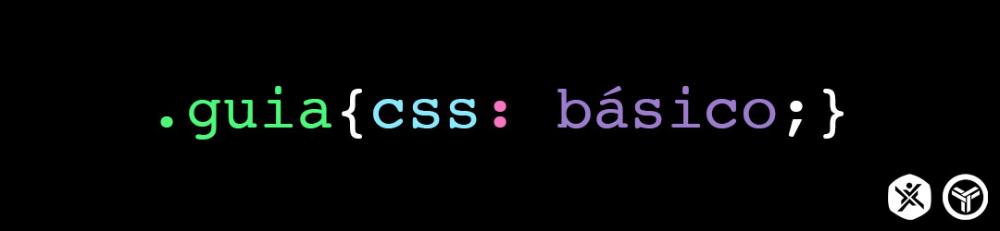

 

# .guia{CSS}
### Um guia CSS para iniciantes e curiosos! :blue_book:

### Tópicos:
1. [Conceitos básicos :heavy_check_mark:](./conceitos-basicos/conceitos-basicos.md)
   - [O que é CSS](./conceitos-basicos/o-que-e-css.md)
   - [Adicionando Estilo ao HTML](./conceitos-basicos/adicionando-estilo-ao-html.md)
   - [Regra CSS](./conceitos-basicos/regra-css.md)
   - [CSS Box Model](./conceitos-basicos/css-box-model.md)
2. [Valores :bar_chart:](./valores/valores.md)
   - [Palavras-chave](./valores/palavras-chave.md)
   - [Comprimento](./valores/comprimento.md)
   - [Cores](./valores/cores.md)
   - [Números](./valores/numeros.md)
   - [Porcentagem](./valores/porcentagem.md)
3. [Seletores :interrobang:](./seletores/seletores.md)
   - [Seletores básicos](./seletores/seletores-basicos.md)  
   - [Combinadores](./seletores/combinadores.md)
   - [Pseudo-classes](./seletores/pseudo-classes.md)
   - [Pseudo-elementos](./seletores/pseudo-elementos.md)
4. [Propriedades :computer:](./propriedades/propriedades.md)
   - [Texto](./propriedades/texto.md)
   - [Cor](./propriedades/cor.md)
   - [Espaçamento](./propriedades/espacamento.md) 

---

## Sobre o guia:

Esse guia foi pensado inicialmente como uma referência para novos membros da FTT ([Fábrica de Tecnologias Turing](http://ftt.unievangelica.edu.br)), uma Fábrica de Software mantida pela UniEvangélica em Anápolis, Goiás.
A ideia era reunir conceitos básicos em português e com exemplos para que os membros da fábrica pudessem usar de maneira prática no trabalho cotidiano e estudar sobre o assunto.  
Mas seu conteúdo pode ser aproveitado por qualquer pessoa que deseja entender um pouco sobre CSS.

### Bibliografia

- MEYER, Eric A. CSS: Pocket Reference. 4ª Edição. Sebastpool, CA: O'Reilly Media, 2011.
- CSS REFERENCE. W3SCHOOLS. Disponível em: <https://www.w3schools.com/cssref/default.asp>. Acesso em: março de 2019.
- CSS: CASCADING STYLE SHEETS. MDN WEB DOCS. Disponível em: <https://developer.mozilla.org/en-US/docs/Web/CSS> Acesso em: março de 2019.
- CSS ALMANAC. CSS-TRICKS. Disponível em: <https://css-tricks.com/almanac/>. Acesso em: março de 2019.

### Criado e mantido por:

[Leo AD](https://twitter.com/theleoad)  

[ftt.unievangelica.edu.br :arrow_backward:](http://ftt.unievangelica.edu.br) 
