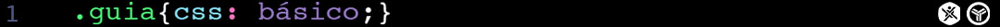

# Pseudo-elementos
###### [Guia CSS](../README.md) > [Seletores](./seletores.md) > Pseudo-elementos
---


Os pseudo-elementos no CSS são usados para adicionar efeitos especiais a alguns seletores. Dessa maneira você não precisará de JavaScript para esse tipo de efeito.
Sobre a sintaxe, eles diferem das pseudo-classes porque usa os dois pontos duplos (::), mas essa mudança só foi implementada a partir do CSS 3, por isso os navegadores aceitam a notação com somente dois pontos (:). De toda maneira é aconselhado usar `::`: `elemento::pseudo-elemento {propriedade: valor}`.

Vamos falar dos pseudo-elementos mais utilizados abaixo.

### ::first-line
Seleciona a primeira linha de um elemento. Normalmente é usado para dar estilo a primeira linha de um parágrafo. A quantidade de texto selecionada por esse seletor vai depender de fatores como tamanho da fonte, altura da linha, espaço entre as letras, tamanho do viewport, etc.  
**Sintaxe**: `elemento::first-line`  
**Como funciona**: `p::first-line` seleciona a primeira linha do elemento `p`.  
**Exemplo**:  
```html
<p>Lorem ipsum dolor sit amet, consectetur adipiscing elit. Curabitur dignissim pharetra nisl nec vehicula. Pellentesque luctus lectus eu sem ultricies faucibus. Cras varius ligula vel arcu consectetur maximus.</p>
```
```css
p::first-line {
    color: purple;
}
```
---

### ::first-letter
Seleciona a primeira letra de um elemento. É importante dizer que por questões idiomáticas pontos que precedam a primeira letra também serão selecionados. Por exemplo se o texto inicar com aspas, as aspas e a primeira letra serão selecionados.  
**Sintaxe**: `elemento::first-letter`  
**Como funciona**: `p::first-letter` seleciona a primeira letra do elemento `p`.  
**Exemplo**:  
```html
<p>Lorem ipsum dolor sit amet, consectetur adipiscing elit. Curabitur dignissim pharetra nisl nec vehicula. Pellentesque luctus lectus eu sem ultricies faucibus. Cras varius ligula vel arcu consectetur maximus.</p>
```
```css
p::first-letter {
    font-size: 1.5em;
}
```
---

### ::before
O seletor `::before` cria um falso elemento antes do elemento em que é utilizado e permite que seja adicionado e estilizado algum conteúdo.  
**Sintaxe**: `elemento::before`  
**Como funciona**: `div::before` cria um elemento antes de qualquer elemento `div`.  
**Exemplo**:  
```html
<div></div>
```
```css
div::before {
    content: 'esse é o ::before';
    color: red;
}
```
---

### ::after
O seletor `::after` cria um falso elemento depois do elemento em que é utilizado e permite que seja adicionado e estilizado algum conteúdo.  
**Sintaxe**: `elemento::after`  
**Como funciona**: `div::after` cria um elemento depois de qualquer elemento `div`.  
**Exemplo**:  
```html
<div></div>
```
```css
div::after {
    content: 'esse é o ::after';
    color: purple;
}
```

[Exemplos de utilização de Pseudo-elementos no Codepen](https://codepen.io/theleoad/pen/WWwGBP/right?editors=1100);

[Exemplos de utilização de vários seletores no Codepen](https://codepen.io/theleoad/pen/pYLwWK/right?editors=1100);


---
#### Nesta Seção:
[**Seletores**](./seletores.md)   
[Seletores Básicos](./seletores-basicos.md) | [Combinadores](./combinadores.md) | [Pseudo-classes](./pseudo-classes.md) | [Pseudo-elementos](./pseudo-elementos.md)



[ftt.unievangelica.edu.br :arrow_backward:](http://ftt.unievangelica.edu.br) 
